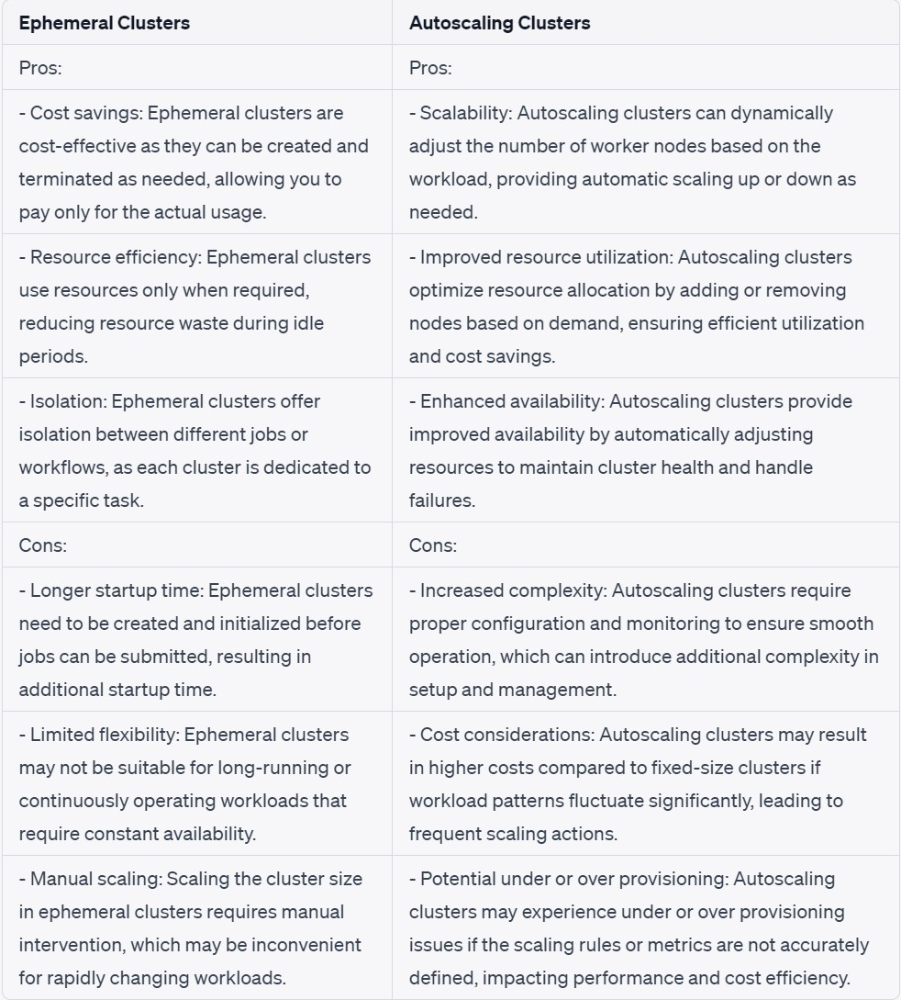
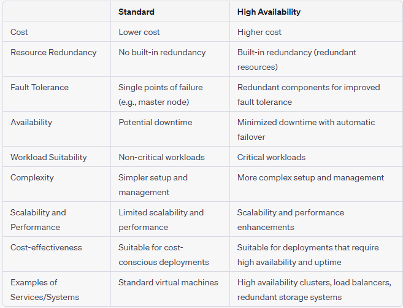
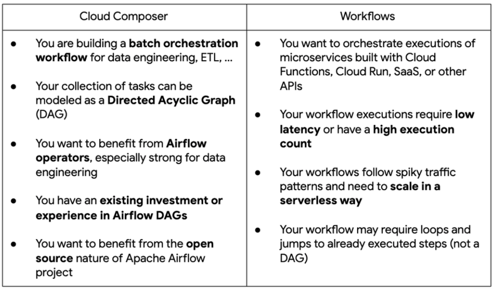

# BigData Tools
- Cloud DataFlow
- Cloud DataProc
- Cloud Pub/Sub
- Cloud Composer

## Cloud DataFlow
- It is a *managed* **stream and batch processing service**.
- Cloud Dataflow pipelines are written using the Apache Beam API.Cloud Dataflow does not require you to configure instances or clusters—it is a **no-ops service**.
- It directly integrates with **Cloud Pub/Sub, BigQuery,Cloud ML Engine, Bigtable and Apache Kafka**.
- Cloud Dataflow is coding transformations in one of the languages supported by Apache Beam, which are currently **Java and Python**.

 **Event_Time**:- It refers to the Time that data element occurs is determined by timestamp on data element itself.
 - **Eg**:- if you're analyzing user activity on a website, the event time would represent the actual time when a user performed a specific action, such as clicking a button or submitting a form.

 **Processing time**:- It refers to the time at which an event or data point is processed or handled by a system or application.
 - **Eg**:- if you have a data pipeline that processes user events, the processing time would represent when the system received and processed each event.
 - Processing time can include various steps like data ingestion, transformation, analysis, and any other operations performed on the event data.

## Cloud Dataflow Concepts:-

 **Pipelines**:- A Dataflow pipeline is a **directed acyclic graph (DAG)** that represents the data processing tasks and their dependencies. 
- It consists of a series of transformations applied to input data to produce the desired output. 
- Pipelines represent a job that can be run *repeatedly*.

 **PCollection**:- PCollection stands for **Processing Collection**, which represents a **distributed, immutable dataset** in a Dataflow pipeline. 
- PCollections are the data elements that flow through the pipeline during processing.
- PCollections can be created from data sources or as the output of transformations.
- In the case of *batch processing*, the PCollection contains a **fixed set of data**. In the case of *streaming data*, the PCollection is **unbounded**.

 **Transforms**:- Transformations are the operations applied to the PCollections to process and transform the data.Transforms operate on one or more PCollections as input and can produce one or more output.
 - Transformations define how the data is processed, transformed, or manipulated within the pipeline.
- Transformations include operations like **filtering, aggregating, joining, mapping**, and more.
- Transformations take input data, perform computations, and generate output data.

 **ParDo**:- ParDo is a **parallel processing operation** that runs a user-specified function on each element in a PCollection.ParDo transforms data in *parallel*.
- ParDo can receive additional inputs from other PCollections through side inputs.Side inputs enable performing joins and accessing data from multiple PCollections within a ParDo.
- ParDo produces a main output PCollection, but it can also generate additional output collections using side outputs.
- Side outputs are useful for creating additional processing paths or handling data that doesn't meet certain criteria, such as using a side output for data that fails a validation check

 **Pipeline I/O**:-These are transforms for reading data into a pipeline from a source and writing data to a sink

 **Aggregation**: It is the process of computing a result from multiple input values

 **User-defined functions**:-UDF are user-specified code for performing some operation, typically using a ParDo

 **Runner**:- Runners are software that executes pipelines as jobs. Dataflow supports different runners that execute the pipeline, including the Dataflow service in GCP, Apache Flink, and Apache Spark. The runner manages the pipeline execution, resource allocation, and fault tolerance.

 **Triggers**:- Triggers define when and how often computations are performed on data within windows. They determine when to produce intermediate or final results based on event time progress or data arrival. 
- Triggers enable fine-grained control over the processing behavior within windows

- when running a Dataflow pipeline, it usually operates in 2 modes:-

**Normal mode**: Pipeline processes available data and terminates when there's no more.

**Drain mode**: Pipeline continues processing remaining data, even without new arrivals.

**drain flag**: Enables drain mode, ensuring all available data is processed before shutdown.
- Useful for handling intermittent or delayed data arrivals gracefully.

## Cloud DataProc
- Cloud Dataproc is a *fully managed service* that allows you to run Apache Hadoop and Apache Spark clusters on GCP.
-  Dataproc is great choice for quickly migrating Hadoop and Spark jobs into GCP.

**Advantages**:-
- It simplifies the deployment, management, and scaling of these big data processing frameworks.
- Cloud Dataproc allows the possibility to use “ephemeral” clusters, where a large cluster can be created to run a task and then destroyed once the task is over in order to save costs.
- The main advantages of using Dataproc over self-managed Hadoop or Spark clusters are easy scalability, the ability to use cloud storage instead of HDFS, and convenient connectors to other GCP services like BigQuery and BigTable.

- Cloud Dataproc clusters consist of **two types** of nodes: master nodes and worker nodes

	**Master node**: It is responsible for distributing and managing workload distribution.They manage cluster resources, schedule tasks, and oversee the execution of jobs. **do not participate directly in data processing**.

	**Worker Nodes**: Worker nodes, also known as worker instances, are responsible for executing data processing tasks. They are the primary workhorses of the cluster, performing tasks such as data ingestion, storage, processing, and analysis. 
    - They distribute and parallelize the workload across the cluster to achieve high performance and scalability.

- master node manages the cluster and delegates tasks to the worker nodes, which handle the actual data processing operations.
- Cluster mode determines the configuration of master and worker nodes in a dataproc cluster. 
- In standard mode --->one master node and multiple worker nodes.
-  In single mode ---> only one master node and no worker nodes.

## Ephemeral Clusters VS AutoScaling Clusters

## Standard VS High Availability

**Note**:- 
- Only the number of worker nodes and preemptible worker nodes can change—master nodes are fixed
- AutoScaling can cause problems and become unstable when used with high availability clusters, and it is not allowed to be used on a single node.
- When using auto scaling, it's better to use cloud storage instead of HDFS storage. However, if you are using HDFS, make sure you have sufficient storage on your primary workers.
- Spark Structured streaming not supported by autoscaling  because the underlying architecture of Spark Structured Streaming does not easily allow for dynamic scaling of resources based on the workload.
- Outputs can be automatically pushed to **BigQuery,CloudStorage and BigTable**.

## Cloud Pub/sub
- Cloud Pub/Sub is a **managed real-time messaging service**.It supports both push and pull subscription models.
- No server or cluster provisioning is required.**Automatic scaling** and **load partitioning** are handled by Cloud Pub/Sub.
- Messages can stay in a topic for up to **seven days**.For guaranteed exactly once processing, use Cloud Dataflow PubsubIO.
- Cloud Dataflow **PubsubIO de-duplicates messages based on a message ID**.Cloud Dataflow can ensure that messages are processed in order.
- Messages published to a topic before a subscription is created will not be delivered to the subscription.
- Cloud Pub/Sub **does not** maintain the **order of the messages**, and it is recommended to have it **timestamped or watermarked** from the publisher and ordered using Dataflow.

### Sliding Windows:- 
- Windows that advance by a number of data points less than the width of the window are called sliding windows.
- Sliding windows are used to illustrate the change over time of an aggregate, such as the average of the last three values.
- The stream of averages is updated each time a new value arrives in the stream.
- Sliding windows provide a dynamic representation of how the aggregate evolves over time.

### Tumbling Windows:-
- windows that advance by the length of the window are tumbling windows.
- Tumbling windows are used when you want to aggregate data over a fixed period of time, for example, for the last one minute

**Session windows**: A session window function defines windows that contain elements that are within a certain gap duration of another element.
- It applies on a per-key basis and is useful for data that is irregularly distributed with respect to time.
- Session windowing is useful when you want to understand how users are interacting with your platform over time, such as measuring session durations, identifying inactive or active periods, or analyzing user behavior within a specific session window.

**Eg**: data stream representing user mouse activity may have long periods of idle time interspersed with high concentrations of clicks. If data arrives after the minimum specified gap duration time, this initiates the start of a new window.

**Late arriving**:-
- Late arriving data refers to data points that arrive after their expected time or after the watermark for a specific time window. 
- While the data points may be considered late, they can still be processed if they fall within a permissible tolerance or if the processing logic allows for handling late arrivals.
- Handling late arriving data involves deciding how long to wait for it and whether to process it immediately or treat it as missing data

**Watermark**:-
- Watermarks are used to determine the completeness of data within a specific time window. They provide a reference point or timestamp that indicates when a certain time period is considered complete.
-  Data points with timestamps earlier than the watermark are considered on-time or early arriving data, while data points with timestamps later than the watermark are considered late arriving data.
- late arriving data refers to data points arriving after their expected time, while watermarks are timestamps used to track the progress of event time and determine the completeness of data within a time window.

## Cloud Composer

 Orchestration often refers to the automated configuration, coordination, and management of multiple interdependent computer systems and services.Orchestration jobs are used to manage and streamline complex processes involving multiple steps, dependencies, and interactions between various components or services. 

**Eg**:- Cloud Composer

- Cron jobs are scheduled tasks that run at predetermined intervals or specific times on a recurring basis.
-  They are typically used for simpler, standalone tasks that don't have complex dependencies or interactions.
- Cron jobs are used for automating repetitive tasks, such as backups, log rotations, data updates, or other periodic activities.
**Eg**:- Cloud Scheduler

### Google Cloud Platform offers a number of tools and services for orchestration:
 **Cloud Scheduler** for schedule driven single-service orchestration.

 **Workflows**:- It is for complex multi-service orchestration(HTTP services).Worklows enables you to automate the execution of **HTTP-based services** running on Cloud Functions and Cloud Run, as well as external services and APIs. Use either **YAML or JSON** to express your workflow.

 **Cloud Composer**:- It is a managed service implementing **Apache Airflow**, which is used for scheduling and managing workflows. It automates the scheduling and monitoring of workflows. It can be used as a managed workflow orchestration of your data workloads **(ETL/ELT)**.

## Cloud Composer vs workflows

**Note**:- 
- Composer is designed for orchestrating batch workloads that can handle a delay of a few seconds between task executions.
-  It wouldn’t be suitable if low latency was required in between tasks, whereas *Workflows* is designed for **latency sensitive** use cases. 
- **Workflows is completely serverless**, eliminating the need to manage or scale infrastructure, unlike Composer where specifying the number of workers is required.