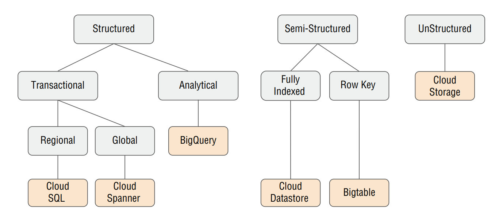

# Databases

 ## Cloud SQL

 - Cloud SQL is a **fully managed relational database** service that supports **MySQL, PostgreSQL, and SQL Server** databases.
 - Cloud SQL is well suited for **regional applications** that do not need to store more than **30 TB** of data in a single instance.
 - Automatic replication,Managed backups.
 - It facilitates **Vertical** & **Horizontal** Scaling.

   **Cloud SQL Proxy**, which provides secure access to Second Generation instances without having to create allow lists or to configure SSL. The proxy manages **authentication and automatically encrypts data**.
 - Cloud SQL is similar to **Amazon RDS**.

 ### Read Replicas:- 
 - A read replica is a copy of a primary database that is **asynchronously replicated** from the *primary database*.
 - A replica database that enables parallel read operations, improving read performance and scalability by offloading read traffic from the primary database. Read replicas must be in the same region as the primary instance
 - Read replicas are not intended for failover purposes and do not automatically take over in case of a primary database failure.
 - replica is used only for **high availability**, not scalability.
 
  **Binary logging** must be enabled to support read replicas. we  *cannot perform* backups on a read replica.
- It's important to note that read replicas are **not** *intended for high availability or disaster recovery purposes*. They are primarily used for **scaling read workloads and improving performance,scalability**.

**Failover replica**: 
- A failover replica is a standby replica that is kept **in sync** with the primary database in real-time or near-real-time.
- A secondary replica database that automatically takes over as the primary in the event of a failure, ensuring high availability and minimal downtime.

- Cloud SQL and Cloud Spanner, provide mechanisms to restrict access to **tables and views**.

## Cloud Spanner
- Cloud Spanner is Google’s relational, horizontally scalable, global database. It also manages automatic replication.
- Cloud Spanner is suitable for read/write operations.
- Google recommends keeping CPU utilization **below 65 percent in regional instances** and **below 45 percent in multi-regional instances**. Also, each node can store up to **2 TB of data**.
- Spanner can compromise (A)Availability from CAP theorem.
- Cloud Spanner **supports** both **primary and secondary indexes**.
- Cloud Spanner provides for secondary indexes on columns or groups of columns other than the primary key.
-  An index is automatically created for the primary key, but you have to define any secondary indexes specifically.
- Secondary indexes are useful when filtering in a query using a WHERE clause.
- Cloud Spanner is its ability to **interleave** data from related tables. This is done through a **parent-child relationship** in which parent data, such as a row from the order table, is stored with child data, such as order line items.
- It  supports up to **seven layers** of interleaved tables.
- Interleaving is used when tables are frequently joined which reduces I/O operations.
- Cloud Spanner breaks data into chunks known as **splits**. Splits are up to about **4 GB** in size and move independently of one another.
- Rows in a split are ordered by primary key, and the first and last keys are known as the split boundaries.
- Rows that are interleaved are kept with their parent row.otherwise it could cause more than 4 GB of data to be interleaved which it can lead to degraded performance.
- Cloud Spanner creates **splits** to **alleviate hotspots**.

**STORING clause** allows you to specify additional columns to store in an index but not include those columns as part of the index

- Cloud Spanner uses a voting mechanism to determine writes.Regional instances use only read-only replicas; multi-regional instances use all three types:

**Read-write replicas**:- maintain full copies of data and serve read operations, and they can vote on write operations

**Read-only replicas**:-  maintain full copies of data and serve read operations, but they do not vote on write operation

**Witness replicas**:- Witness replicas do not keep full copies of data but do participate in write votes. Witness replicas are helpful in achieving a majority when voting.
- Avoid hotspots by not using consecutive values for primary keys.  

**Recommended ways to avoid hotspots for a primary key**:
- Using a Hash of the Natural Key.
- Swapping the Order of Columns in Keys to Promote Higher-Cardinality Attributes(columns that have a large number of distinct values).
- Using a Universally Unique Identifier (UUID), Specifically Version 4 or Later.
- Using Bit-Reverse Sequential Values.

## BigQuery
- BigQuery is fully managed, petabyte-scale, low-cost analytics data warehouse databases.
- Standard SQL supports advanced SQL features, such as correlated subqueries, ARRAY and STRUCT data types, as well as complex join expressions.
- BigQuery supports nested and repeated structures in rows. Nested data is represented in STRUCT type in SQL, and repeated types are represented in ARRAY types in SQL.
- BigQuery provides **2 metrics** for *Slots*. **Slots Allocated** to the project and **Slots Available** for the project.

**Data Warehouses**: These are centralized, organized repositories of analytical data for an organization.

**Data Marts**: These are subsets of data warehouses that focus on particular business lines or departments.

**Data Lakes**: These are less structured data stores for raw and lightly processed data.

- **BigQuery** is designed to support **data warehouses and data marts**.
- **Data lakes** may be implemented using object storage, such as **Cloud Storage**, or NoSQL databases, such as **Cloud Bigtable**.

**BigQuery Data Transfer Service**:- It is a fully managed service that automates the transfer of data from SaaS applications like Google Analytics, into BigQuery. 
   - This service simplifies the process of importing data from Google Analytics and provides features like scheduling, monitoring, and error handling.
   - It automate the data movement from data sources such as Google Ads and Google AD Manager.
   -  BigQuery Transfer Service has a **restrictive destination** - it can only load data into BigQuery datasets and **cannot transfer the ingested data anywhere else outside of BigQuery**.

- BigQuery has two different mechanisms for querying external data: **external tables and federated queries**.
- Query performance for **external data sources may not be as high** as querying data in a native BigQuery table.
- If query speed is a priority, load the data into BigQuery instead of setting up an external data source. 
- Federated storage is used to query data stored in Cloud Storage, Bigtable, or Google Drive,Cloud SQL,Cloud Spanner.
- An external data source (also known as a **federated data source**) is a data source that allows you to query directly even though the data is not stored in BigQuery.using external tables in BigQuery is useful for such cases:
  - Perform ETL operations on data.
  - Frequently changed data.
  - Data is being ingested periodically.
  - Temporary tables will be available for approximately 24 hours.
- When accessing external data, you can create either **permanent or temporary external tables**.
  - Permanent external tables are linked to external sources and created in datasets with access controls. Useful for ongoing access.
  - Temporary external tables are created in a special dataset and last ~24 hours. Useful for one-time operations like data loading.
  - Permanent tables allow dataset-level access controls. Temporary tables do not support access controls.
- BigQuery maintains a **seven-day** history of changes so that you can query a past snapshot(versions) of data.

 **Streaming inserts** in BigQuery provide best effort de-duplication. By including an insertID that uniquely identifies a record, BigQuery can detect duplicates and prevent them from being inserted. However, if no insertID is provided, BigQuery does not attempt to de-duplicate the data.
- BigQuery supports both **batch and streaming data processing**.*Batching data* to BigQuery is **free**, while *streaming data* is **charged** based on size.

**Federated queries on protobuf message fields from Bigtable cannot be performed using BigQuery due to differences in data structures and query capabilities between the two systems**.

**To query data from Bigtable in BigQuery, it is recommended to export the data from Bigtable to a compatible format such as Avro or Parquet, and then load it into BigQuery for querying**.
- Wildcard tables support built-in BigQuery storage only. You cannot use wildcards when querying an external table or a view.

**Caching** : It is the process of storing frequently accessed data in a temporary storage area so that it can be quickly retrieved at a later time without having to go back to the original source.
- predictive (pre-fetch) cache is only active for data sources that use the owner’s credentials to access the underlying data.
- Data Studio caching maximum period is 12 hours.
- BigQuery writes query results to a table, either a destination table specified by the user or a temporary, cached results table.**Temporary, cached results tables** incur **no storage costs** and are maintained per-user, per-project; whereas storing query results in a **permanent table** will result in **storage charges**.
- Temporary, cached results tables are created in an "anonymous dataset" with restricted access.Access to anonymous datasets is limited to the dataset owner.
- **Anonymous datasets** are *hidden* and their names **start with an underscore, not appearing in the datasets list** in the GCP Console or the classic BigQuery web UI.
- Listing anonymous datasets and auditing access controls can be done using the CLI or the API.
- When an **anonymous dataset** is created, the **user** running the query job is explicitly given **"bigquery.dataOwner" access to the anonymous dataset**.
- "bigquery.dataOwner" access gives the user who ran the query job full control over the dataset, including full control over the cached results tables in the anonymous dataset

**bigquery.dataEditor**: Users with this role can **enable caching** for a dataset and **perform data editing tasks**.

**bigquery.dataOwner**: Users with this role have **all the permissions of the "bigquery.dataEditor" role, plus the ability to manage access controls for the dataset**.

### StackDriver

**Stackdriver Monitoring** is utilized for tracking performance metrics in BigQuery, including query counts and query execution time.
- The data collected by Stackdriver Monitoring can be viewed on Stackdriver Monitoring dashboards and used for alerting.
- Stackdriver Monitoring collects metrics on a range of operations, including
    - Number of scanned bytes
    - Query time
    -  Slots allocated
    -  Slots available
    - Number of tables in a dataset
    - Uploaded rows

**Stackdriver Logging** is employed to monitor events such as job executions or table creations in BigQuery.
- Logs are useful for understanding who is performing actions in BigQuery, whereas monitoring is useful for understanding how your queries and jobs are performing.
- Logs are maintained in Stackdriver for a specific period of time known as the retention period.If you want to keep them longer, you will need to export the logs before the end of the retention period.
- Admin activity audit logs, system event audit logs, and access transparency logs are kept for 400 days. Data access audit logs and other logs not related to auditing are kept 30 days.

**Stackdriver Trace** is a distributed tracing system designed to collect data on how long it takes to process requests to services. It is available in Compute Engine, Kubernetes Engine. It useful when you’re using microservices architectures.

- BigQuery does **not** have **indexes** like relational databases or document databases, but it **does** support **partitioning and clustering** both of which can help limit the amount of data scanned during queries.

**Partitioning**:-It involves dividing a large table into smaller and more manageable pieces based on a specified column, such as date or region.
- BigQuery provides query cost estimates before the query is run on a partitioned table.
- BigQuery has a limit of **4,000 partitions** per table.
- This allows queries to only scan the relevant partitions, rather than scanning the entire table, which can significantly reduce query time and cost.
- As the number of partitions increases, the amount of metadata overhead increases.
- BigQuery has **3** partition types:
    - **Ingestion time partitioned tables** : Tables are partitioned based on the timestamp when BigQuery ingests the data.
    - **Timestamp partitioned tables**: Tables are partitioned based on a time value such as timestamps or dates.
    - **Integer range partitioned tables**: Tables are partitioned based on an integer column's range.

- **_PARTITIONTIME and _PARTITIONDATE** are available only in ingestion-time partitioned tables. Partitioned tables do not have pseudo columns **not** available in non-ingestion-time partitioned tables.
- Rows with null values in the DATE or TIMESTAMP column are stored in a __NULL__ partition, and rows that have dates outside the allowed range are stored in a partition called __UNPARTITIONED__.

**Clustering**:-It is the ordering of data in its stored format. This can improve query performance by reducing the amount of data that needs to be scanned within a partition, since the related data will be physically located closer together.

**Clustering is supported only on partitioned tables**, and it is used when filters or aggregations are frequently used.
- BigQuery has a limit of **4 cluster columns** per table. clustering columns cannot be changed
- cost of queries over clustered tables can only be determined **after** the query is run.

**Partioning vs Clustering**
- Use **partitioning** when you have large datasets and frequently query subsets of the data based on specific criteria like time ranges, date-based filters, or integer ranges.
- Use **clustering** when you have data with strong correlation patterns and want to optimize query performance by physically reordering the data based on one or more columns.

**BigQuery BI Engine**
- BigQuery BI Engine is an **in-memory analysis** service for Google BigQuery, designed to accelerate business intelligence (BI) workloads and enhance query performance.
- It provides high-speed analytics capabilities by caching and processing data in-memory, reducing query response times significantly.

**authorized Views vs materialized views**

**authorized Views**:Authorized views in Google BigQuery are virtual views that provide an additional layer of access control on top of the underlying tables or datasets.
- These views allow you to control what data users can access and what operations they can perform on the data without granting direct access to the underlying tables.
- When you create the view, it must be created in a dataset separate from the source data queried by the view.
- You cannot grant permissions on only authorized views as the lowest permission level is data set.
- No need to copy tables when you can use authorized views.

**materilaized views**:A materialized view is a special type of database view that stores the results of a query as a physical table. This means that the query results are computed once and stored in the materialized view, so future queries can directly access the precomputed data without re-evaluating the query.
- cost of storing the materialized results is much less than the cost of processing large amounts of data.

**Non-Materialized Views**: On the other hand, non-materialized views (sometimes called regular views) are just saved queries that don't store the query results as physical tables. When you query a non-materialized view, the database performs the query calculations each time you access the view.

**Points to Remember**:-
- **sharding** is a method of dividing a database into multiple, smaller databases, while partitioning is a method of dividing a single, large table into smaller, more manageable pieces.
- splitting data by date or timestamp, you can use partitions, and to split data into multiple tables by other attributes, you can try sharding
- **SLA** stands for **Service Level Agreement**. It is a commitment or guarantee made by a service provider to its users or customers regarding the level of service availability or performance they can expect
- Wildcards cannot be used with views or external tables.
- cluster nodes can download the dependencies from Cloud Storage from internal IPs.
- Dataproc has a BigQuery connector library which allows it directly interface with BigQuery.BigQuery connector is a Java library that enables Hadoop to process data from BigQuery using abstracted versions of the Apache Hadoop InputFormat and OutputFormat classes.
- BigQuery requires data to be encoded in UTF-8. If a CSV file is not in UTF-8, BigQuery attempts to convert it, but the conversion may not always be accurate, leading to differences in some bytes.
- Specifying encoding ensures correct character interpretation. Explicit encoding prevents data corruptions and misinterpretations.
-  To ensure proper loading, specify the correct encoding. Similarly, **JSON files need to be in UTF-8 encoding when loading into BigQuery**.
- **AVRO**:-It is the recommended format for data loading in BigQuery due to its ability to read data blocks in parallel, even when the file is compressed. Unlike CSV files, Avro does not have encoding issues, making it a preferred choice for efficient and reliable data loading.
- **PARQUET**:-It is another data storage format that utilizes a columnar model. Uncompressed CSV and JSON files can be loaded faster compared to compressed files because they can be loaded in parallel. However, loading uncompressed files in parallel can result in higher storage costs when using Cloud Storage.
- Schema **auto-detection** is **not used with Avro files, Parquet files, ORC files, Firestore export files, or Datastore export files**.

## Cloud Firestore

- Google Cloud Datastore is a **NoSQL document database** built for **automatic scaling, high performance**, and ease of application development and integrating well with **App Engine**.
- Cloud Firestore is the managed document database that is replacing **Cloud Datastore**.Document databases are used when the structure of data can vary from one record to another.
- Cloud Datastore offers **Fully managed No-Ops NoSQL** solution which is **suited** for **Semistructured data and ideal for product catalogs**.
- Cloud Datastore offers **automated backups** and the ability to restore data to any point within the last **30 days**.
- It store highly structured objects in a document database, with support for **ACID transactions and SQL-like queries**.
- Datastore has **weaker transactions** than RDBs and is **better** for **schemaless data**. So for a **defined schema and strong transaction needs**, an **RDB(cloud SQL)** is recommended over Datastore.
- Cloud Firestore operates in one of two modes: 
	
    **Native Mode**:- the new data model, realtime updates, and mobile and web client library features are available only in Native Mode.

    **Cloud Datastore Mode**:- In Datastore mode, Firestore offers **strong consistency** and removes the limitations of 25 entity groups and one write per second to an entity group that were present in Datastore.

- Indexes are used when querying and must exist for any property referenced in filters
- Cloud Firestore uses two kinds of indexes:

    **built-in indexes**:- Built-in indexes are created by default for each property in an entity. 

    **composite indexes**:- They are used when there are multiple filter conditions in a query. They are defined in a configuration file called **index.yaml**.

- Cloud Firestore in Datastore Mode is a managed document database that is well suited for applications that require semi-structured data but that do not require low-latency writes (< 10 ms).
- When *low-latency writes* are needed, **Bigtable** is a better option.

**Firestore** is a suitable choice if you need to store well-organized data in a document database, ensuring transactional integrity and the ability to perform SQL-like queries.
- Datastore is designed for web applications of a small scale.
- If you use **VPC Service Controls**, you must use the **Firestore service agent** to fully protect import and export operations. 
- VPC Service Controls is **not compatible** with the **App Engine service account**.

##  Bigtable:-
- Bigtable provides a scalable, fully-managed NoSQL wide-column database that is suitable for both real-time access and analytics workloads.
- Cloud Bigtable supports up to **4 replicated clusters**.
- Cloud Bigtable is used for **high-volume databases** that require **low millisecond (ms) latency**.
- Cloud Bigtable is used for **IoT, time-series, finance**, and similar applications.
- Bigtable is a **managed service**, but it is **not a No-Ops service**: like Cloud SQL and Cloud Spanner.
- Bigtable also excels as a **storage engine** for **batch MapReduce operations, stream processing/analytics,and machine-learning applications**.
- Data is stored in Bigtable lexicographically by row-key, which is the one indexed column in a Bigtable table.
- goal when designing a row-key is to take advantage of the fact that **Bigtable stores data in a sorted order**.
- Bigtable provides **eventual consistency**, which means that the data in clusters may not be the same sometimes, but they eventually will have the same data.
- When creating a Cloud Bigtable instance and cluster, the **choice between SSD or HDD storage for the cluster is permanent** and cannot be changed using the Google Cloud Platform Console.
- If you need to convert an existing HDD cluster to SSD, or vice-versa, you can export the data from the existing instance and import it into a new instance.
- Alternatively, you can use a Cloud Dataflow or Hadoop MapReduce job to copy the data from one instance to another.
- It's important to note that migrating an entire instance takes time, and you may need to add nodes to your Cloud Bigtable clusters before initiating the migration.
- The **dataset location cannot be changed** once created. The dataset needs to be copied using Cloud Storage.

**App profiles** are configurations for handling client requests in Cloud Bigtable.
- For *strong consistency*, specify **single-cluster** routing in the app configuration and avoid using other clusters except for failover.
- To enable automatic failover in Cloud Bigtable when one region becomes unreachable, use **multicluster routing**.

**Key Visualizer** is a Cloud Bigtable tool for understanding usage patterns in a Cloud Bigtable database.
- It generates visual reports for your tables that break down your usage based on the row keys that you access. 
- This tool helps you identify the following:
  - Where hotspots exist
  - Rows that may contain too much data
  - The distribution of workload across all rows in a table

## Characteristics of a good row-key:-
- Using a prefix for multitenancy isolates data from different customers, making scans and reads more efficient by ensuring that data blocks contain data from one customer only, allowing customers to query only their own data.
-  when a using a **multitenant Cloud Bigtable database**, it is a good practice to use a **tenant prefix** in the row-key.In this situation, the **first part of the rowkey could be a customer ID or other customer-specific code**.
- String identifiers, such as a **customer ID or a sensor ID**, are good candidates for a rowkey.
- **Timestamps** may be used as part of a row-key, but they should **not be the entire row-key or the start of the row-key**.
- Nonsequential value in the first part of the row-key, which helps avoid hotspots
- To avoid hotspots, never use a timestamp value as a row key prefix.
- Moving timestamps from the front of a row-key so that another attribute is the first part of the row-key is an example of **field  promotion**
- *Field promotion* is a recommended practice as it helps **prevent hotspotting** and simplifies the design of a row key for efficient querying.
- Another way to avoid hotspots is to use **salting**, which is the process of adding a derived value to the key to make writes noncontiguous.

 **Domain names,Sequential numeric IDs,Frequently updated identifiers,Hashed values** are *anti-patterns* which are not to be used for designing the row-key.

**Best Practices**:-
- Bigtable has a limit of **1,000 tables** per instance.
- Limit **table** to around **100 column families** to avoid performance issues.
- Limit **row size** to **100 MB or less** to maintain optimal read performance.
- Keep **cell size below 10 MB** and use **shorter row keys(4 KB or less) to optimize memory**, storage, and response times in Cloud Bigtable.
- **Minimum 1TB** is required to store the data in bigtable.
- Google Cloud recommends keeping **storage utilization below 60% per node** in bigtable for low latency applications.

**If you're running a performance test that depends upon Cloud Bigtable, be sure to follow these steps**
- Use a production instance.
- Use at least 300 GB of data. 
- Before you test, run a heavy pre-test for several minutes
- Run your test for at least 10 minutes.

**Note**:-
**Failover** in cloud computing is the process of automatically transferring workloads from a failed or failing primary resource to a secondary resource in order to minimize downtime and ensure continuity of service.
- Hotspots can be caused by a number of factors, such as a heavily used table or an inefficient query that repeatedly touches the same data.
- They can also result from the database architecture itself, such as data being stored in a manner that causes read or write operations to be heavily concentrated in certain areas.
- Primary index is always based on the primary key of a table, which is a unique identifier for each row.  
- Bigtable does **not** have **secondary indexes**.
- By default, Bigtable returns the value in the cell with the **latest timestamp**
- Cloud Bigtable tables are **sparse**—that is, if there is no data for a particular row/column/cell combination, then no storage is used.
- Bigtable distributes **write operations based on the row key**, not one of the GCP load balancers

## Cloud Memorystore
- Cloud Memorystore is a **fully managed Redis service**, which is commonly used for **caching**.you can store data in **key-value format**.
    - **Memcached useCases**: Use Memcached when you need a *simple and fast caching solution* for key-value data without the need for advanced features.
    - **Redis Usecases**: Use Redis when you require a *versatile data store* with support for *complex data structures*, **persistence, pub/sub messaging**, and other advanced features beyond caching.
- In Redis, if the memory usage **surpasses 80 percent** of the system memory, the instance is deemed to be **under memory pressure*. To alleviate this, several actions can be taken: 

    **Scaling up the instance**: Increasing the resources allocated to the Redis instance can help accommodate higher memory requirements.
  
    **Lowering the maximum memory limit**: Reducing the maximum memory limit for Redis can prevent excessive memory usage.

    **Modifying the eviction policy**: Changing the eviction policy determines how Redis selects which keys to remove when memory is full.

    **Setting time-to-live (TTL) parameters**: Applying TTL parameters to volatile keys specifies the duration for which a key should be retained in the cache before it becomes eligible for eviction.

   **Manually deleting data**: Removing data manually from the Redis instance can free up memory space and alleviate memory pressure.
- **By default, Redis evicts the least recently used keys with TTLs set**.

## Cloud Storage
- Cloud Storage is a specialized storage system that primarily deals with **unstructured data**, including files, images, videos, backups, and various other types of data.
- In Cloud Storage, data is organized and stored as individual objects, which are treated as atomic units. 
- This means that each object is independent and self-contained, allowing for efficient storage and retrieval of unstructured data.
- Google Cloud Storage is **not suitable** to handle **real time streaming data**.
- A bucket is a group of objects that share access controls at the bucket level.**Cloud Storage service does not use a filesystem**.
- Cloud Storage can be used as both the staging area for storing data immediately after ingestion and also as a long-term store for transformed data

**Bucket Naming**:-
- Do not use sequential names or timestamps if uploading files in parallel.
-  Files with sequentially close names will likely be assigned to the same server. 
- This can create a hotspot when writing files to Cloud Storage.
- Bucket names can only contain lowercase letters, numeric characters, dashes (-), underscores (_), and dots (.). 
- Spaces are not allowed. Bucket names cannot be represented as an IP address in dotted-decimal notation. 
- Bucket names cannot begin with the "goog" prefix. Bucket names cannot contain "google" or close misspellings, such as "g00gle".

### Four types of Cloud Storage:-

 **Regional Storage:** This class stores multiple copies of an object in multiple zones within a single region. It offers high availability and is suitable for applications with regional requirements.

 **Multi-regional Storage:** To mitigate the risk of a regional outage, multi-regional storage stores replicas of objects in multiple regions. It provides greater resilience and is recommended for globally distributed applications.

 **Nearline Storage:** If data is accessed less than once in 30 days, Nearline storage is a suitable option. It offers cost-effective storage with slightly higher latency compared to regional storage. It is well-suited for backup and archival data.**30days**.

 **Coldline Storage:** Data accessed less than once a year is a good fit for Coldline storage. It provides the most cost-effective archival storage option, although with slightly higher access latency. Coldline storage is ideal for long-term retention of infrequently accessed data**90days**

 **Cloud Storage Archive class storage** It is a storage class provided by Google Cloud Storage. It is designed for data that is accessed infrequently and requires long-term retention at a lower cost compared to other storage classes**365days**

- All storage classes have the same latency to return the first byte of data, but the costs to access data and 
the per-operation costs are higher than regional storage.

