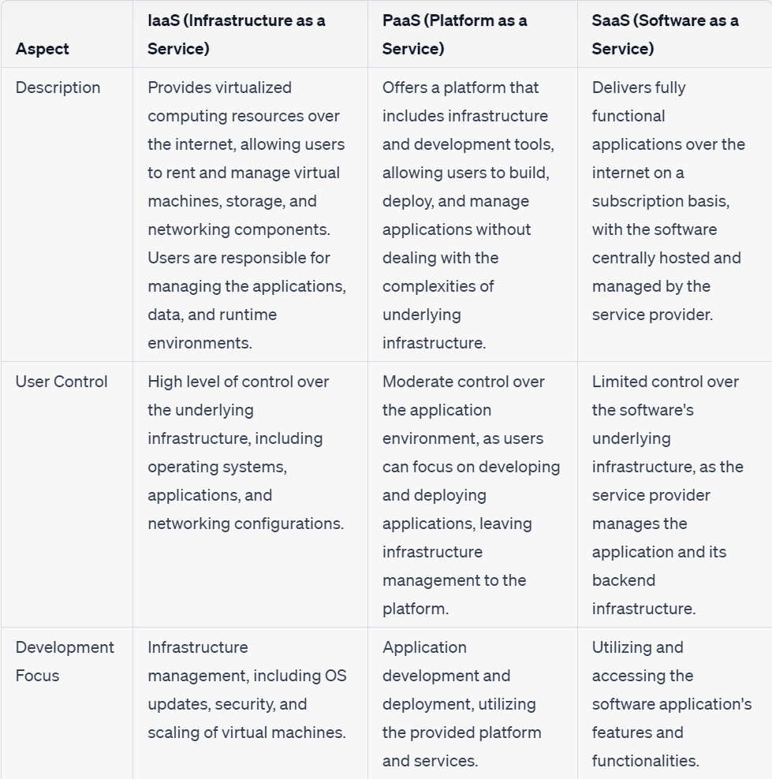

Four key compute options:
- Compute Engine
- Kubernetes Engine
- App Engine
- Cloud Functions

**Compute Engine**:-It is a IaaS Product where users have full access to the VM's operating system.while using Compute Engine, you have the greatest level of control over your instances, but you are also responsible for configuring managed instance groups, load balancers, and autoscalers. 
- when using Compute Engine, you are responsible for ensuring **high availability and scalability**.This is done with **managed instance groups (MIGs)**.
- Compute Engine currently supports attaching up to **8 GPUs to a single instance**.

**MIG**:-A managed instance group is a set of VMs with identical configurations that are managed as a single unit by compute engine.
-  Managed instance groups are configured with a minimum and a maximum number of instances.
- The configuration of a VM in a managed instance group is specified in a template, known as an **instance template**.
- *advantages* of a managed instance group is that the number of VMs in the group can change according to **workload(AutoScaling)**.
- **Un-managed instance groups** allow for heterogeneous VMs they should be used only when migrating legacy clusters from on-premises data centers.

**Kubernetes Engine**:- It is a Paas Product where it is a managed container orchestration platform that simplifies the deployment and management of containerized applications using Kubernetes.
- Containers are increasingly used to process workloads because they have less overhead than VMs and allow for finer-grained allocation of resources than VMs.

    **Pods**:- Pods are the smallest computation unit managed by Kubernetes.Pods are deployed to nodes by the scheduler.They are ephemeral and may be terminated if they are not functioning properly.

    **Services**:-It is an abstraction with a stable API endpoint and stable IP address.A service keeps track of its associated pods so that it can always route calls to a functioning pod.

    **ReplicaSets**:- It is a controller that manages the number of pods running for a deployment.
	
    **Deployments**:- It is a higher-level concept that manages ReplicaSets and provides declarative updates.

    **PersistentVolumes**:- PersistentVolumes is Kubernetes’s way of representing storage allocated or provisioned for use by a pod. Pods acquire access to persistent volumes by creating a PersistentVolumeClaim, which is a logical way to link a pod to persistent storage.
	
    **StatefulSets**:- Kubernetes uses the StatefulSets abstraction, which is used to designate pods as stateful and assign a unique identifier to them. Kubernetes uses these to track which clients are using which pods and to keep them paired.

    **Ingress**:-It is an object that controls external access to services running in a Kubernetes cluster.

- Node pools are collections of VMs running in managed instance groups.
- Cluster autoscaling is done at the node pool level.

**kubectl** is a command-line tool used for managing Kubernetes clusters. It allows users to control various components of Kubernetes and interact with the cluster.
- To check the number of replicas running, you can use the "kubectl get deployments" command, which provides information about deployment names, desired and current replica counts, available replicas, and the duration of application running in the cluster.
- to adjust the number of replicas for a deployment named pde-example-application:**kubectl scale deployment pde-example-application --replicas 6**

**App Engine**:- It is also a Paas product which is designed to allow developers to focus on application development while minimizing their need to support the infrastructure that runs their applications.
- It is a good option when your application is developed in one of the supported languages and needs to scale up and down based on workload.They are 2 versions:

	**App Engine Standard**- It is a platform for running applications in a **language-specific serverless environment**. It supports Go,Java,PHP,Node.js and python.
    - It is available in 2 forms: 1st generation, 2nd generation. 2nd generation services offer more money and more runtime options.

	**App Engine Flexible**- It runs **Docker containers**. It allows developers to customize their runtime environments in ways not available in App Engine Standard.
    -  It is a good option when you want to have the advantages of a PaaS as well as the ability to customize your runtime environment.

- You can configure your service as well as supporting services by specifying three files: 
	
    **app.yaml**:-It has three required parameters: runtime, handlers , and threadsafe. runtime specifies the runtime environment, such as Python3.

	**cron.yaml**:-It is used to configure scheduled tasks for an application.

	**dispatch.yaml**:- It is a place for specifying routing rules to send incoming requests to a specific service based on the URL.

**Cloud Functions**:- It is a **serverless, managed compute service** for running code in response to *events* that occur in the cloud.
- Events such as **writing a message to a Cloud Pub/Sub topic or uploading a file to Cloud Storage can trigger the execution of a Cloud Function**. It is written using JavaScript, Python 3, and Go.
- The parameter Timeout refers to the maximum allowed duration for a function to run before it is forcibly terminated. 
- By default, the timeout period is set to **1 minute**, but it can be adjusted to a**maximum of 9 minutes**. If the function exceeds the timeout, it will be forcefully stopped.
- cloud function handles one request at a time.

**Load balancers** direct traffic only to responsive instances, and they use health checks to determine which instances are available to accept traffic.

  **global load balancers** are HTTP(S) Load Balancing, SSL Proxy, and TCP Proxy.

  **regional load balancers** are Network TCP/UDP, Internal TCP/UDP, and Internal HTTP(S)

**persistent disks** are storage devices in the cloud that act like hard drives for your virtual machines (VMs). They are used to store data and files that your applications need to run and operate.
  - Persistent disks are used with *virtual machines* and would require additional cost and operational overhead to store this data on persistent disk.
  - Persistent Disks in GCP are **restricted to a specific region**, which means they cannot be accessed from instances in different regions, potentially limiting data availability and redundancy for multi-region setups.
  - Persistent Disks **not suitable for extremely high-performance workloads or applications that require ultra-low latency storage**. 
  - Persistent disks are used with **Compute Engine and Kubernetes Engine** to provide network based disk storage to VMs and containers and should not be used for **archival storage**.
  - Persistent disks have built-in redundancy for **high availability and reliability**, meaning your data is safe and **won't be lost even if your virtual machine is turned off or restarted**.

- *For high-throughput use cases*, enterprises can use **Cloud Interconnect**. Cloud Interconnect is available as a **dedicated interconnect** in which an enterprise directly connects to a Google endpoint and traffic flows directly between the two networks.
- Dedicated Interconnect provides a direct physical connection between an on-premises data center and a Google Cloud VPC, allowing for high-speed, low-latency, and secure data transfer.
-  With Dedicated Interconnect, you can provision a dedicated **10 Gbps or 100 Gbps** connection between your on-premises network and your VPC.

**partner interconnect**, in which case data flows through a **third-party network but not over the Internet**.

## Transfer Sevices in GCP

 **Transfer Appliance**:
   - Use case: Use Transfer Appliance when you have a large volume of data (terabytes to petabytes) to transfer to Cloud Storage, and your outbound network capacity is limited or slow.It would take more than one week to upload your data over the network.
   - How it works: You request a Transfer Appliance from Google, load your data onto the device, and then ship it back to Google for the data to be transferred to your Google Cloud Storage account.
   - Benefits:
     - Fast and efficient transfer: It can handle large datasets that might take a long time to transfer over the internet.
     - Security: Data is encrypted during transit and at rest on the appliance.
     - Offline transfer: Eliminates the need for high-speed internet connections.
   - Limitations:
     - One-time use: It is not designed for repeated or ongoing data transfers.
     - Physical logistics: Requires shipping the appliance back and forth, which can introduce additional time and effort.

 **Storage Transfer Service**:
   - Use case: Transfer data between different cloud storage providers or from on-premises systems to Google Cloud Storage.
   - Use Storage Transfer Service when you have relatively smaller amounts of data (gigabytes to a few terabytes) to transfer to Cloud Storage, and you want a fully managed and automated data transfer process.
   - How it works: You configure a transfer job, specifying the source and destination storage providers, and schedule the transfers.
   - Benefits:
     - Automated transfers: Allows for scheduled and recurring data transfers.
     - Network-based transfer: Suitable for transferring data over the internet.
     - Flexibility: Supports a variety of storage providers and transfer options.
   - Limitations:
     - Limited to supported sources and destinations: You need to ensure your data source and destination are supported by the Storage Transfer Service.
     - Network constraints: The speed of transfer depends on your network bandwidth and connectivity.

- In summary, the Transfer Appliance is ideal for one-time or infrequent large-scale transfers, particularly when network limitations or security concerns make online transfers impractical. 
- On the other hand, the Storage Transfer Service is better suited for scheduled, recurring, or online transfers between various storage providers.
- Transferring **from another cloud storage provider** Use **Storage Transfer Service**.
- Transferring **less than 1 TB** from on-premises or from another Cloud Storage region Use **gsutil**.
- Transferring **more than 1 TB** from on-premises Use **Transfer service for on-premises data**.

