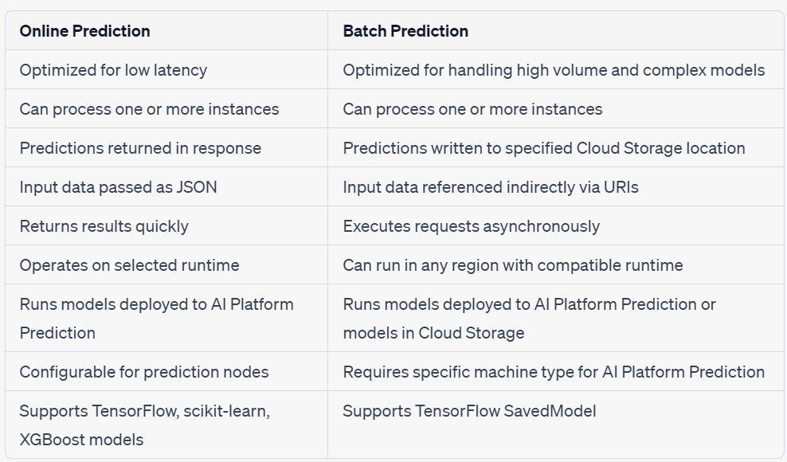

# Types of MachineLearning

## Supervised ML:-
- It is used to make predictions.It learn from labelled data.
- ML model is used to predict a discrete value-->**Classification Model**.
- Eg:-Support Vector Machine(SVM),Decision Tree,Logistic Regression
- ML model is used to predict a continuous value-->**Regression Model**.
- Eg:- Linear Regression,Lasso & Ridge Regression,Random Forest Regression, Gradient Boost Regression(XGBoost)

## Unsupervised Learning:- 
- These algorithms learn by starting with unlabeled data and then identifying salient features, such as groups or clusters, and anomalies in a data stream.
- Eg:- K-means Clusering,K-Nearest Neighbour,Principal Component Analysis,Anomaly Detection Algorithms
    - **Clustering**: It is the process of grouping instances together based on common features.
    - **Anomaly Detection**: It is a process of identifying unexpected patterns ins data.
    - **Collaborative Filtering**: It is widely used in recommendation systems such as netflix,google to provide personalized recommendations to users based on their past behavior and preferences.

## Reinforcement Learning:-
- It trains a model by interacting with it's environment & receiving feedback on the decision that it makes.
- It is especially useful in robotics and game playing.
- Eg:- Q-Learning,Monte Carlo Tree Search

## Deep Learning:
- It is not a kind of problem but a way to solve ML problems. It can be used with any of the three types of ML problems.

## ML Glossary

- The function that maps from inputs to outputs is known as an **activation function**
- eg:- Rectified Linear Unit(RELU),hyperbolic tangent function,Sigmoid Function.

 **Feature engineering** is the process of identifying which features are useful for building models. It also includes adding new features derived from existing features.

- An **epoch** is the term used to describe one full pass over a training dataset by the training algorithm.

 **Backpropagation** is the most widely used algorithm for training neural networks, and it uses the error and the rate of change in the error to 
calculate weight adjustments.

 **Learning rate**:- It is a hyperparameter that controls how much weights of a neural network are adjusted with each iteration during training.

 **Note**:-
1. Smaller learning rate can lead to longer training times.
2. learning rate that are too large can ignore optimal weights.

 **Regularization**:- It is used to prevent overfitting & improve the generalization performance of a model. It helps to reduce the complexity of model, preventing overfitting which will improve accuracy & robustness of ML models.

 **Bias** is the difference between the average prediction of a model and the correct prediction of a model.Models with high bias tend to have oversimplified representations of the process that generates the training data; this is underfitting the model

 **Variance** is the variability in model predictions. It helps to understand how model prediction differs across multiple training datasets.Models 
with high variance tend to overfit training data.

- models should have both **low bias and low variance**, and this is achieved by **lowering the mean squared error (MSE)** of the model by working through multiple training datasets.

 **Underfitting** creates a model that is not able to predict values of training data correctly or new data that was not used during training.

 **Overfitting** occurs when an ML model is trained too well on a particulart dataset & unable to generalize new data.This happens when 
there is noise in the data and the model fits the noise as well as the correct data points.To solve the overfitting problem in the scenario, you need to:
  -  Increase the training set.
  -  Decrease features parameters.
  -  Increase regularization.

 **L1 regularization** calculates a penalty based on the absolute value of the weights.L1 regularization should be used when you want less relevant features to have weights close to zero.

 **L2 regularization** calculates a penalty based on the sum-of-the-squares of the weights. L2 regularization should 
be used when you want outlier instances to have weights close to zero, which is especially useful when working with linear models.

 **Dropout Regularization**: It is a regularization method to remove a random selection of the fixed number of units in a neural network layer. More units dropped out, the stronger the regularization.

 **Gradient Descent**: It is an optimization algorithm to find the minimal value of a function. Gradient descent is used to find the minimal RMSE or cost function.

 **Cost Function** : It measures the error between predicted output of the model and the actual output.
 -   Cost Function & Loss Function are often interchangeable terms in ML.
 -   Cost Function more commonly used in ML.
 -   Loss Function more commonly used in Deep Learning.

## Evaluation models:-

- **Accuracy**:It tells you how often a classification model makes correct predictions. It measures the overall correctness of the model's predictions.
  - Accuracy = (TP + TN) / (TP + TN + FP + FN)

- **Precision**:It focuses on the accuracy of positive predictions made by the model. It measures how often the model correctly predicts positive instances out of all the instances it predicted as positive.
	- Precision = TP / (TP + FP)

- **Recall**: It is a measure of how many actual positive predictions are identified.Recall is also known as sensitivity.
  - Recall = TP / (TP + FN)

- **F1 Score**: It is harmonic mean of precision & recall.F1 scores are useful when you want to optimize a model to have balanced precision and 
recall.
-  It is also a good metric to use when evaluating models built with imbalanced training sets.
	- F1 Score = 2 * [(Precision * Recall) / (Precision + Recall)]

## Online vs Batch Prediction

## ML API's

 **Vision**:- Allows you to derive insights from static images in the cloud or at edge,
- Cloud Vision API
- Cloud Video Intelligence API

**Translation**:-
- Cloud Translation API
- Cloud Natural Language API

**Conversation**:-
- Cloud Text-to-Speech API
- Speech-to-text
- Dialogflow

## GCP Options for Deploying ML Pipeline:
-  Cloud Auto ML
-  BigQuery ML 
-  Kubeflow 
- Spark ML

**Cloud Auto ML** :- It is a machine learning service designed for developers who want to incorporate machine learning in their applications without having to learn many of the details of ML. 
- It is  good to use when pre-trained API models are not sufficient for the task and need to train a model for a specific problem.

 **Several ML products**:-

 **AutoML Vision** :This service enables users to train their own machine learning models to classify images.

 **AutoML Video Intelligence**:It can be used to train machine learning models to classify segments of video using a custom set of labels.It can detect and track multiple objects through video segments.

 **AutoML Natural Language**: It enables developers to deploy machine learning applications that can analyze documents and classify them, identify entities in the text, and determine sentiment or attitudes from text.

 **AutoML Translation**:It is used to create custom tranlsation models.

 **AutoML Tables**: It builds machine learning models based on structured data.provide info on missing data,correlation,cardinalities.

 **BigQuery ML** enables users of the analytical database to build machine learning models using SQL and data in BigQuery datasets.
- It can be accesssed through BigQuery webUI,REST API,bq command-tool, External tools including Jupyter Notebooks
- It supports ML algorithms including **Linear regression,Binary logistic regression,Multiple logistic regression,K-means clustering and TensorFlow**.
- **Note**:-
- AutoML Tables is a suitable choice when you want to optimize your model without extensive experimentation by automating feature engineering tasks and testing various algorithms.
- If minimizing model generation time is a priority, BigQueryML is a better option as it provides faster results by focusing on utilizing BigQuery's capabilities.

 **Kubeflow** is an open source project for developing, orchestrating, and deploying scalable and portable machine learning workloads.Kubeflow is designed for the Kubernetes platform.
- Kubeflow originally began life as a tool to help run TensorFlow jobs on Kubernetes, but it expanded to a multicloud framework for running ML pipelines. 
- Kubeflow can be used to run machine learning workloads in multiple clouds or in a hybrid cloud environment.

**Note**:- 
- Kubeflow is an ideal option for running machine learning workloads if you are familiar with Kubernetes Engine and have prior experience in building machine learning models.
- While Kubeflow enables scalable usage of machine learning models, it does not offer the same level of features as AutoML or the simplicity of BigQuery ML.

 **Spark MLib** is a comprehensive set of machine learning tools that can be used when deploying Cloud Dataproc clusters.

 **Note**:-
- Cloud AutoML is designed for developers who want to build on existing machine learning models and tools that automate some machine learning tasks, like feature engineering.
- BigQuery ML allows SQL users to build models within BigQuery and avoid having to export data and develop models using Python or Java.
- Kubeflow supports deploying scalable ML pipelines in Kubernetes.
- If you need an algorithm not available in other GCP machine learning services, consider using Spark MLib.
- Cloud Vision offers both pretrained models via an API and the ability to build custom models using AutoML Vision to provide flexibility depending on your use case.
- Cloud ML Engine is used to deploy models. It does not help to build the models.
- Deep and wide models are ideal for a recommendation application.**Wide models** are used for memorization. **Deep models** are for generalization.
